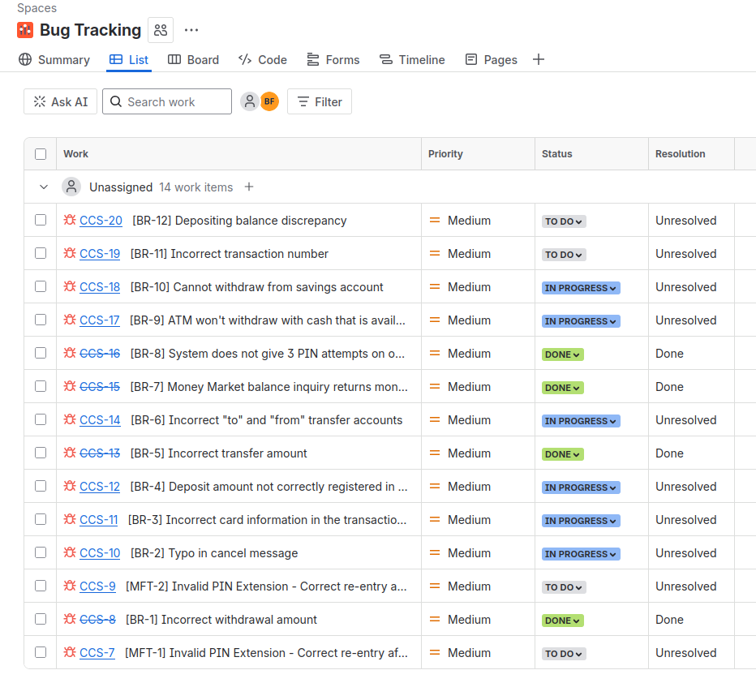

# SENG 637 Assignment 1

## Introduction to Testing and Defect (Bug) Tracking

**Group #13**
- Kundai
- Matin
- Behzad

**GitHub:** &lt;https://github.com/behzadfuladpanjeh/seng637-a1&gt;

**Winter 2026**

---

## Table of Contents

1. [Introduction](#1-introduction)
   - [1.1 System Under Test (SUT)](#11-system-under-test-sut)
   - [1.2 Testing Environment](#12-testing-environment)
2. [Test Strategy](#2-test-strategy)
   - [2.1 Scope of Testing](#21-scope-of-testing)
     - [2.1.1 Use Cases to be Tested](#211-use-cases-to-be-tested)
   - [2.2 Test Types](#22-test-types)
   - [2.3 Risks and Issues](#23-risks-and-issues)
   - [2.4 Test Logistics](#24-test-logistics)
3. [Test Objectives](#3-test-objectives)
4. [Test Criteria](#4-test-criteria)
   - [4.1 Suspension Criteria](#41-suspension-criteria)
   - [4.2 Exit Criteria](#42-exit-criteria)
5. [Resource Planning](#5-resource-planning)
   - [5.1 System Resources](#51-system-resources)
   - [5.2 Human Resources](#52-human-resources)
6. [Test Environment](#6-test-environment)
7. [Schedule & Estimation](#7-schedule--estimation)
8. [Test Deliverables](#8-test-deliverables)
9. [Exploratory Test Results](#9-exploratory-test-results)
   - [BR-1: Incorrect withdrawal amount](#bug-report-br-1)
   - [BR-2: Typo in cancel message](#bug-report-br-2)
   - [BR-3: Incorrect information](#bug-report-br-3)
   - [BR-4: Deposit amount not correctly registered](#bug-report-br-4)
   - [BR-5: Incorrect transfer amount](#bug-report-br-5)
   - [BR-6: Incorrect to and from transfer accounts](#bug-report-br-6)
   - [BR-7: Money Market balance inquiry](#bug-report-br-7)
   - [BR-8: System does not give 3 pin attempts](#bug-report-br-8)
   - [BR-9: ATM won't withdraw with cash available](#bug-report-br-9)
   - [BR-10: Cannot withdraw from savings account](#bug-report-br-10)
10. [Test Cases](#10-test-cases)
11. [Regression Testing](#11-regression-testing)
12. [Test Summary Report](#12-test-summary-report)
13. [Comparison of Results](#13-comparison-of-results)
14. [Issue Tracking System](#14-issue-tracking-system)

---

## 1. Introduction

The Test Plan is designed to prescribe the scope, approach, resources, and schedule of all testing activities for the ATM Simulation System. The plan identifies the features to be tested, the types of testing to be performed, and how we will partake in getting the testing done. The primary goal of testing is to verify that the ATM system correctly supports all required customer and operator functions, handles normal and exceptional scenarios safely, and communicates properly with the bank system with accurate transaction logging.

### 1.1 System Under Test (SUT)

| | |
|:---|:---|
| **System Name** | ATM Simulation System |
| **Version 1.0** | Initial release with known defects |
| **Version 1.1** | Updated release with partial bug fixes |

### 1.2 Testing Environment

| | |
|:---|:---|
| **Defect Tracking Tool** | Jira |
| **Testing Method** | Pair Testing |

---

## 2. Test Strategy

### 2.1 Scope of Testing

The exploratory testing which will be performed is aligned towards using the ATM system to perform all the common use cases which the system would see. This is the main approach in the exploratory testing section because this is where we are looking at the system from the perspective of a common user. Thus, making the common use cases and standard path the best way to stumble on certain bugs. In addition, we will check boundary conditions and the most common edge cases that can be thought of to slightly stretch the capabilities of what the system can handle.

**In Scope:**
- System startup/shutdown
- Withdrawal transactions
- Deposit transactions
- Transfer transactions
- Balance inquiry
- PIN validation

**Out of Scope:**
- Bank computer communication (simulated)
- Physical hardware components

#### 2.1.1 Use Cases to be Tested

**a) Common / Happy Path Scenarios**
- Successful login → withdrawal → receipt → card return
- Successful deposit → envelope inserted → confirmation → receipt
- Successful transfer and balance inquiry

**b) Exceptional / Edge Case Scenarios**
- Invalid PIN entries (1, 2, and 3 attempts → card retention)
- Deposits not in multiples of $20
- Bank rejects a transaction
- Cancel key pressed during:
  - PIN entry
  - Transaction selection
  - Amount entry
  - Deposit envelope prompt
- Attempting to shut down the ATM while servicing a customer

**c) Boundary Conditions**
- Minimum and maximum withdrawal amounts
- Zero-dollar transfer or deposit attempts
- Last available cash in machine

### 2.2 Test Types

- Exploratory Testing
- Manual Feature Testing
- Regression Testing

### 2.3 Risks and Issues

| Risk | Mitigation |
|:---|:---|
| Insufficient test coverage | Use exploratory testing and boundary testing |
| Tight project deadlines | Prioritize high-risk features |
| Incomplete requirements | Review requirements with creator and provided documentation |

### 2.4 Test Logistics

Our group consisting of 3 members performed the following tests:

| Test type | Tester | Role | Responsibility |
|:---|:---|:---|:---|
| Exploratory | Kundai | Driver | Operate the SUT, execute tests |
| | Behzad | Observer | Review results, document defects |
| Manual Scripted | Behzad | Driver | Operate the SUT, execute tests |
| | Matin | Observer | Review results, document defects |
| Regression | Matin | Driver | Operate the SUT, execute tests |
| | Kundai | Observer | Review results, document defects |

---

## 3. Test Objectives

Verify that the ATM system meets functional requirements, handles errors gracefully, maintains security, and provides correct transaction processing.

---

## 4. Test Criteria

### 4.1 Suspension Criteria

Testing will be suspended if more than 40% of test cases fail or if critical system crashes occur.

### 4.2 Exit Criteria

- All critical and high-priority defects must be resolved
- At least 85% of test cases must be passed

---

## 5. Resource Planning

### 5.1 System Resources

- Desktop computer
- ATM simulator software
- Test documentation
- System documentation

### 5.2 Human Resources

- Tester
- Instructor / Reviewer

---

## 6. Test Environment

Testing will be performed on a desktop computer running the ATM simulation software.

---

## 7. Schedule & Estimation

| Activity | Duration |
|:---|:---|
| Test planning | 1 hour |
| Test case design | 1 hour |
| Test execution | 5 hours |
| Defect reporting | 2 hours |
| **Total estimated effort** | **9 hours** |

---

## 8. Test Deliverables

- Test cases
- Bug reports
- Test summary report

---

## 9. Exploratory Test Results

### Bug Report BR-1

| Field | Details |
|:---|:---|
| **Title** | Incorrect withdrawal amount |
| **Function Being Tested** | Withdraw |
| **Initial State of the System** | ATM is powered on and at the main menu |
| **Steps to Reproduce** | 1. Insert valid card&lt;br&gt;2. Enter the correct PIN&lt;br&gt;3. Click checking&lt;br&gt;4. Press 2 |
| **Expected Outcome** | ATM should withdraw $40 |
| **Actual Outcome** | ATM withdraws $60 |
| **Severity / Priority** | Critical |
| **Version of SUT** | V 1.0 |

### Bug Report BR-2

| Field | Details |
|:---|:---|
| **Title** | Typo in cancel message |
| **Function Being Tested** | Transaction cancellation |
| **Initial State of the System** | Transaction menu |
| **Steps to Reproduce** | 1. Select Withdraw&lt;br&gt;2. Press cancel |
| **Expected Outcome** | Should read "Would you like..." |
| **Actual Outcome** | Message reads "Wood you like..." |
| **Severity / Priority** | Low |
| **Version of SUT** | V 1.0 |

### Bug Report BR-3

| Field | Details |
|:---|:---|
| **Title** | Incorrect information |
| **Function Being Tested** | Transaction receipt |
| **Initial State of the System** | Processed transaction menu |
| **Steps to Reproduce** | 1. ATM powered on&lt;br&gt;2. Enter the credit card number 1&lt;br&gt;3. Enter the correct pin, 42&lt;br&gt;4. Click transaction to withdraw&lt;br&gt;5. Enter the amount |
| **Expected Outcome** | Receipt should read CARD #1 |
| **Actual Outcome** | Receipt reads card #2 |
| **Severity / Priority** | Medium |
| **Version of SUT** | V 1.0 |

### Bug Report BR-4

| Field | Details |
|:---|:---|
| **Title** | Deposit amount not correctly registered in account |
| **Function Being Tested** | Deposit |
| **Initial State of the System** | ATM is powered on and at the main transaction menu. $40 in the checking account |
| **Steps to Reproduce** | 1. Select Deposit&lt;br&gt;2. Choose accounts&lt;br&gt;3. Enter $20&lt;br&gt;4. Insert envelope |
| **Expected Outcome** | Checking should increase by $20 to $60 total |
| **Actual Outcome** | Checking account increases by $10 to $50 |
| **Severity / Priority** | Critical |
| **Version of SUT** | V 1.0 |

### Bug Report BR-5

| Field | Details |
|:---|:---|
| **Title** | Incorrect transfer amount |
| **Function Being Tested** | Transfer transaction |
| **Initial State of the System** | User authenticated at transaction menu |
| **Steps to Reproduce** | 1. Select transfer&lt;br&gt;2. Select Checking, to transfer money from&lt;br&gt;3. Select savings, to transfer money to&lt;br&gt;4. Enter an amount of $20 |
| **Expected Outcome** | In receipt amount should be $20 |
| **Actual Outcome** | In receipt amount is $19.50 |
| **Severity / Priority** | Critical |
| **Version of SUT** | V 1.0 |

### Bug Report BR-6

| Field | Details |
|:---|:---|
| **Title** | Incorrect to and from transfer accounts |
| **Function Being Tested** | Transfer transaction |
| **Initial State of the System** | User authenticated at transaction menu |
| **Steps to Reproduce** | 1. Select transfer&lt;br&gt;2. Select checking, to transfer money from&lt;br&gt;3. Select savings, to transfer money to&lt;br&gt;4. Enter an amount of $20 |
| **Expected Outcome** | ATM receipt should show TRANSFER FROM: CHKG TO: SVGS |
| **Actual Outcome** | ATM receipt shows TRANSFER FROM: SVGS TO: CHKG |
| **Severity / Priority** | Critical |
| **Version of SUT** | V 1.0 |

### Bug Report BR-7

| Field | Details |
|:---|:---|
| **Title** | Money Market balance inquiry returns money from ATM |
| **Function Being Tested** | Balance inquiry |
| **Initial State of the System** | User authenticated and requests a balance inquiry |
| **Steps to Reproduce** | 1. Select balance inquiry&lt;br&gt;2. Select the Money Market |
| **Expected Outcome** | The ATM should not dispense cash and show Money Market balance |
| **Actual Outcome** | ATM dispenses $500 cash |
| **Severity / Priority** | High |
| **Version of SUT** | V 1.0 |

### Bug Report BR-8

| Field | Details |
|:---|:---|
| **Title** | System does not give 3 pin attempts on other card |
| **Function Being Tested** | Invalid pin entry for new card |
| **Initial State of the System** | Other card is inserted into ATM |
| **Steps to Reproduce** | 1. Insert card&lt;br&gt;2. Type card number 4&lt;br&gt;3. Enter incorrect pin |
| **Expected Outcome** | ATM should show incorrect pin message |
| **Actual Outcome** | ATM ejects card after one attempt |
| **Severity / Priority** | Low |
| **Version of SUT** | V 1.0 |

### Bug Report BR-9

| Field | Details |
|:---|:---|
| **Title** | ATM won't withdraw with cash available |
| **Function Being Tested** | Withdraw |
| **Initial State of the System** | ATM has an authenticated card at the transaction menu. Balance inquiry shows total balance to be $50.50 and available to be $20.50 |
| **Steps to Reproduce** | 1. Select Withdraw&lt;br&gt;2. Select $20 |
| **Expected Outcome** | ATM should withdraw $20 and provide a receipt |
| **Actual Outcome** | ATM shows insufficient funds message and does not withdraw |
| **Severity / Priority** | High |
| **Version of SUT** | V 1.0 |

### Bug Report BR-10

| Field | Details |
|:---|:---|
| **Title** | Cannot withdraw from savings account |
| **Function Being Tested** | Transaction withdraw |
| **Initial State of the System** | User authenticated at the transaction menu with sufficient funds |
| **Steps to Reproduce** | 1. Select withdraw&lt;br&gt;2. Select savings&lt;br&gt;3. Select $20 |
| **Expected Outcome** | The ATM should withdraw $20 and provide receipt of the transaction |
| **Actual Outcome** | Transaction is cancelled and invalid account type message is shown |
| **Severity / Priority** | Medium |
| **Version of SUT** | V 1.0 |

---

## 10. Test Cases

### Table 11: Test Cases for Version 1.0

| Test Case # | Use Case | Function Being Tested | Initial System State | Input | Expected Output | Result | Defect ID |
|:---|:---|:---|:---|:---|:---|:---|:---|
| 1 | System Startup | System is started when the switch is turned "on" | System is off | Activate the "on" switch | System requests initial cash amount | PASS | |
| 2 | System Startup | System accepts initial cash amount | System is requesting cash amount | Enter a legitimate amount | System is on | PASS | |
| 3 | System Startup | Connection to the bank is established | System has just been turned on | Perform a legitimate inquiry transaction | System output should demonstrate that a connection has been established to the Bank | PASS | |
| 4 | System Shutdown | System is shut down when the switch is turned "off" | System is on and not servicing a customer | Activate the "off" switch | System is off | PASS | |
| 5 | Session | System reads a customer's ATM card | System is on and not servicing a customer | Insert a readable card | Card is accepted; System asks for entry of PIN | PASS | |
| 6 | Session | System rejects an unreadable card | System is on and not servicing a customer | Insert an unreadable card | Card is ejected; System displays an error screen; System is ready to start a new session | PASS | |
| 7 | Session | System accepts customer's PIN | System is asking for entry of PIN | Enter a PIN | System displays a menu of transaction types | PASS | |
| 8 | Session | System allows customer to perform a transaction | System is displaying menu of transaction types | Perform a transaction | System asks whether customer wants another transaction | PASS | |
| 9 | Session | System allows multiple transactions in one session | System is asking whether customer wants another transaction | Answer yes | System displays a menu of transaction types | PASS | |
| 10 | Session | Session ends when customer chooses not to do another transaction | System is asking whether customer wants another transaction | Answer no | System ejects card and is ready to start a new session | PASS | |
| 11 | Transaction | System handles an invalid PIN properly | A readable card has been entered | Enter an incorrect PIN and then attempt a transaction | The Invalid PIN exception is performed | PASS | |
| 12 | Withdrawal | System asks customer to choose an account to withdraw from | Menu of transaction types is being displayed | Choose Withdrawal transaction | System displays a menu of account types | PASS | |
| 13 | Withdrawal | System asks customer to choose a dollar amount to withdraw | Menu of account types is being displayed | Choose checking account | System displays a menu of possible withdrawal amounts | PASS | |
| 14 | Withdrawal | System performs a legitimate withdrawal transaction properly | System is displaying the menu of withdrawal amounts | Choose an amount that the system currently has and which is not greater than the account balance | System dispenses this amount of cash; System prints a correct receipt showing amount and correct updated balance; System records transaction correctly in the log (showing both message to the bank and approval back) | PASS | |
| 15 | Withdrawal | System verifies that it has sufficient cash on hand to fulfill the request | System has been started up with less than the maximum withdrawal amount in cash on hand; System is requesting a withdrawal amount | Choose an amount greater than what the system currently has | System displays an appropriate message and asks customer to choose a different amount | PASS | |
| 16 | Withdrawal | System verifies that customer's balance is sufficient to fulfill the request | System is requesting a withdrawal amount | Choose an amount that the system currently has but which is greater than the account balance | System displays an appropriate message and offers customer the option of choosing to do another transaction or not | PASS | |
| 17 | Withdrawal | A withdrawal transaction can be cancelled by the customer any time prior to choosing the dollar amount | System is displaying menu of account types | Press "Cancel" key | System displays an appropriate message and offers customer the option of choosing to do another transaction or not | PASS | |
| 18 | Withdrawal | A withdrawal transaction can be cancelled by the customer any time prior to choosing the dollar amount | System is displaying menu of dollar amounts | Press "Cancel" key | System displays an appropriate message and offers customer the option of choosing to do another transaction or not | PASS | |
| 19 | Deposit | System asks customer to choose an account to deposit to | Menu of transaction types is being displayed | Choose Deposit transaction | System displays a menu of account types | PASS | |
| 20 | Deposit | System asks customer to enter a dollar amount to deposit | Menu of account types is being displayed | Choose checking account | System displays a request for the customer to type a dollar amount | PASS | |
| 21 | Deposit | System asks customer to insert an envelope | System is displaying a request for the customer to type a dollar amount | Enter a legitimate dollar amount | System requests that customer insert an envelope | PASS | |
| 22 | Deposit | System performs a legitimate deposit transaction properly | System is requesting that customer insert an envelope | Insert an envelope | System accepts envelope; System prints a correct receipt showing amount and correct updated balance; System records transaction correctly in the log (showing both message to the bank, approval back, and acceptance of the envelope) | FAIL | Also found in exploratory testing |
| 23 | Deposit | A deposit transaction can be cancelled by the customer any time prior to inserting an envelope | System is displaying menu of account types | Press "Cancel" key | System displays an appropriate message and offers customer the option of choosing to do another transaction or not | PASS | |
| 24 | Deposit | A deposit transaction can be cancelled by the customer any time prior to inserting an envelope | System is requesting customer to enter a dollar amount | Press "Cancel" key | System displays an appropriate message and offers customer the option of choosing to do another transaction or not | PASS | |
| 25 | Deposit | A deposit transaction can be cancelled by the customer any time prior to inserting an envelope | System is requesting customer to insert an envelope | Press "Cancel" key | System displays an appropriate message and offers customer the option of choosing to do another transaction or not | PASS | |
| 26 | Transfer | System asks customer to choose an account to transfer from | Menu of transaction types is being displayed | Choose Transfer transaction | System displays a menu of account types specifying transfer from | PASS | |
| 27 | Transfer | System asks customer to choose an account to transfer to | Menu of account types to transfer from is being displayed | Choose checking account | System displays a menu of account types specifying transfer to | PASS | |
| 28 | Transfer | System asks customer to enter a dollar amount to transfer | Menu of account types to transfer to is being displayed | Choose savings account | System displays a request for the customer to type a dollar amount | PASS | |
| 29 | Transfer | System performs a legitimate transfer transaction properly | System is displaying a request for the customer to type a dollar amount | Enter a legitimate dollar amount | System prints a correct receipt showing amount and correct updated balance; System records transaction correctly in the log (showing both message to the bank and approval back) | FAIL | Also found in exploratory testing |
| 30 | Transfer | A transfer transaction can be cancelled by the customer any time prior to entering dollar amount | System is displaying menu of account types specifying transfer from | Press "Cancel" key | System displays an appropriate message and offers customer the option of choosing to do another transaction or not | PASS | |
| 31 | Transfer | A transfer transaction can be cancelled by the customer any time prior to entering dollar amount | System is displaying menu of account types specifying transfer to | Press "Cancel" key | System displays an appropriate message and offers customer the option of choosing to do another transaction or not | PASS | |
| 32 | Transfer | A transfer transaction can be cancelled by the customer any time prior to entering dollar amount | System is requesting customer to enter a dollar amount | Press "Cancel" key | System displays an appropriate message and offers customer the option of choosing to do another transaction or not | PASS | |
| 33 | Inquiry | System asks customer to choose an account to inquire about | Menu of transaction types is being displayed | Choose Inquiry transaction | System displays a menu of account types | PASS | |
| 34 | Inquiry | System performs a legitimate inquiry transaction properly | System is displaying menu of account types | Choose checking account | System prints a correct receipt showing correct balance; System records transaction correctly in the log (showing both message to the bank and approval back) | PASS | |
| 35 | Inquiry | An inquiry transaction can be cancelled by the customer any time prior to choosing an account | System is displaying menu of account types | Press "Cancel" key | System displays an appropriate message and offers customer the option of choosing to do another transaction or not | PASS | |
| 36 | Invalid PIN Extension | Customer is asked to reenter PIN | System is asking for entry of PIN | Enter an incorrect PIN; Attempt an inquiry transaction on the customer's checking account | Customer is asked to re-enter PIN | PASS | |
| 37 | Invalid PIN Extension | Correct re-entry of PIN is accepted | Request to re-enter PIN is being displayed | Enter correct PIN | Original transaction completes successfully | PASS | |
| 38 | Invalid PIN Extension | Incorrect re-entry of PIN is not accepted | Request to re-enter PIN is being displayed | Enter incorrect PIN | An appropriate message is displayed and re-entry of the PIN is again requested | PASS | |
| 39 | Invalid PIN Extension | Correct re-entry of PIN on the second try is accepted | Request to re-enter PIN is being displayed | Enter incorrect PIN the first time, then correct PIN the second time | Original transaction completes | FAIL | MFT-1 Error: Please enter your PIN Then Press ENTER |
| 40 | Invalid PIN Extension | Correct re-entry of PIN on the third try is accepted | Request to re-enter PIN is being displayed | Enter incorrect PIN the first and second times, then correct PIN the third time | Original transaction completes | FAIL | MFT-2 Error: Please enter your PIN Then Press ENTER |

---

## 11. Regression Testing

### Table 12: Test of Old Bugs in Version 1.0 Compared to Version 1.1 (Regression Test)

| Bug ID | Title | Found In | Fixed in V1.1? | Status / Regression Notes |
|:---|:---|:---|:---|:---|
| BR-1 | Incorrect withdrawal amount | V 1.0 | Yes | **Resolved:** Verified correct amount in V1.1 |
| BR-2 | Typo in cancel message | V 1.0 | Partial | **In progress:** "Wood" fixed, but "transaction" is now misspelled |
| BR-3 | Incorrect information (Receipt Card #) | V 1.0 | No | **In progress:** Defect still in version 1.1; regression bug found |
| BR-4 | Deposit amount not correctly registered | V 1.0 | Yes | **In progress:** Defect still in version 1.1, regression bug found. The amount is still $.10 off |
| BR-5 | Incorrect transfer amount | V 1.0 | Yes | **Resolved:** Verified correct amount in V1.1 |
| BR-6 | Incorrect to and from transfer accounts | V 1.0 | No | Transfer from checking to savings is still incorrect, still shows savings to checking |
| BR-7 | Money Market inquiry dispenses cash | V 1.0 | Yes | **Resolved:** Verified correct amount in V1.1 |
| BR-8 | System does not give 3 PIN attempts | V 1.0 | Yes | **Resolved:** Allows three tries before denying access |
| BR-9 | ATM won't withdraw with cash available | V 1.0 | No | Balance shows a different amount that is available. The balance is the correct amount, and the available is wrong |
| BR-10 | Cannot withdraw from savings account | V 1.0 | Partial | **In progress:** Allows you to withdraw amount from savings but balance shows wrong number |
| **BR-11** | **NEW:** Incorrect transaction number | **V 1.1** | N/A | **NEW:** Regression bug; wrong card and sequence number |
| **BR-12** | **NEW:** Depositing balance discrepancy | **V 1.1** | N/A | **NEW:** Regression bug; balance off by $0.10 |

---

## 12. Test Summary Report

### Table 14: Test Summary Report

| Test Case # | Function Being Tested | Result V 1.0 | Result V 1.1 | Notes |
|:---|:---|:---|:---|:---|
| 1 | System is started when the switch is turned "on" | PASS | PASS | |
| 2 | System accepts initial cash amount | PASS | PASS | |
| 3 | Connection to the bank is established | PASS | PASS | |
| 4 | System is shut down when the switch is turned "off" | PASS | PASS | |
| 5 | System reads a customer's ATM card | PASS | PASS | |
| 6 | System rejects an unreadable card | PASS | PASS | |
| 7 | System accepts customer's PIN | PASS | PASS | |
| 8 | System allows customer to perform a transaction | PASS | PASS | |
| 9 | System allows multiple transactions in one session | PASS | PASS | |
| 10 | Session ends when customer chooses not to do another transaction | PASS | PASS | |
| 11 | System handles an invalid PIN properly | PASS | PASS | |
| 12 | System asks customer to choose an account to withdraw from | PASS | PASS | |
| 13 | System asks customer to choose a dollar amount to withdraw | PASS | PASS | |
| 14 | System performs a legitimate withdrawal transaction properly | PASS | PASS | |
| 15 | System verifies that it has sufficient cash on hand to fulfill the request | PASS | PASS | |
| 16 | System verifies that customer's balance is sufficient to fulfill the request | PASS | PASS | |
| 17 | A withdrawal transaction can be cancelled by the customer any time prior to choosing the dollar amount | PASS | **FAIL** | Does not display message for customer another transaction, only ejects card |
| 18 | A withdrawal transaction can be cancelled by the customer any time prior to choosing the dollar amount | PASS | PASS | |
| 19 | System asks customer to choose an account to deposit to | PASS | PASS | |
| 20 | System asks customer to enter a dollar amount to deposit | PASS | PASS | |
| 21 | System asks customer to insert an envelope | PASS | PASS | |
| 22 | System performs a legitimate deposit transaction properly | FAIL | **FAIL** | Less $0.10 deposited |
| 23 | A deposit transaction can be cancelled by the customer any time prior to inserting an envelope | PASS | PASS | |
| 24 | A deposit transaction can be cancelled by the customer any time prior to inserting an envelope | PASS | PASS | |
| 25 | A deposit transaction can be cancelled by the customer any time prior to inserting an envelope | PASS | PASS | |
| 26 | System asks customer to choose an account to transfer from | PASS | PASS | |
| 27 | System asks customer to choose an account to transfer to | PASS | PASS | |
| 28 | System asks customer to enter a dollar amount to transfer | PASS | PASS | |
| 29 | System performs a legitimate transfer transaction properly | FAIL | **FAIL** | Wrong transfer direction |
| 30 | A transfer transaction can be cancelled by the customer any time prior to entering dollar amount | PASS | PASS | |
| 31 | A transfer transaction can be cancelled by the customer any time prior to entering dollar amount | PASS | PASS | |
| 32 | A transfer transaction can be cancelled by the customer any time prior to entering dollar amount | PASS | PASS | |
| 33 | System asks customer to choose an account to inquire about | PASS | PASS | |
| 34 | System performs a legitimate inquiry transaction properly | PASS | PASS | |
| 35 | An inquiry transaction can be cancelled by the customer any time prior to choosing an account | PASS | PASS | |
| 36 | Customer is asked to reenter PIN | PASS | PASS | |
| 37 | Correct re-entry of PIN is accepted | PASS | PASS | |
| 38 | Incorrect re-entry of PIN is not accepted | PASS | PASS | |
| 39 | Correct re-entry of PIN on the second try is accepted | FAIL | **Fail** | Error: Please enter your PIN Then Press ENTER |
| 40 | Correct re-entry of PIN on the third try is accepted | FAIL | **Fail** | Error: Please enter your PIN Then Press ENTER |

---

## 13. Comparison of Results

### Exploratory vs Scripted Testing

*(Content to be added based on analysis)*

---

## 14. Issue Tracking System

During this lab, **Jira** was used as the primary defect tracking tool to record, manage, and review all identified bugs in the ATM System. Jira allowed the team to create structured defect reports containing essential information such as:

- Function being tested
- Initial system state
- Reproduction steps
- Expected and actual results
- Severity level
- System version

---

*End of Document*
